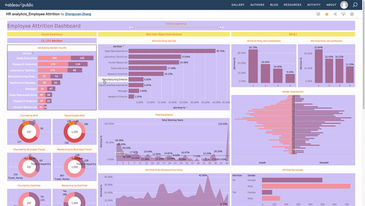

# Tableau-Employee-Attrition
Tableau/ Data Visualization

This is a Tableau dashboard project regarding Employee Attrition.

To access with this [**URL**](https://public.tableau.com/app/profile/zhongyuan.zhang/viz/HRanalytics_EmployeeAttrition/Dashboard1)

The dashboard consists of three parts: Count Summary; Attrition rate Distribution and DE & I
 - The total attrition rate is 16.12%, which is higher than the ideal 10% benchmark
 - The top roles that have higher attrition rate than average: **Sales representatives**,**Laboratory Techinician**,**Human Resource**,**Sales Executive**,**Research Scientist**. The sales team is experiencing high attrition rate.
 - 

